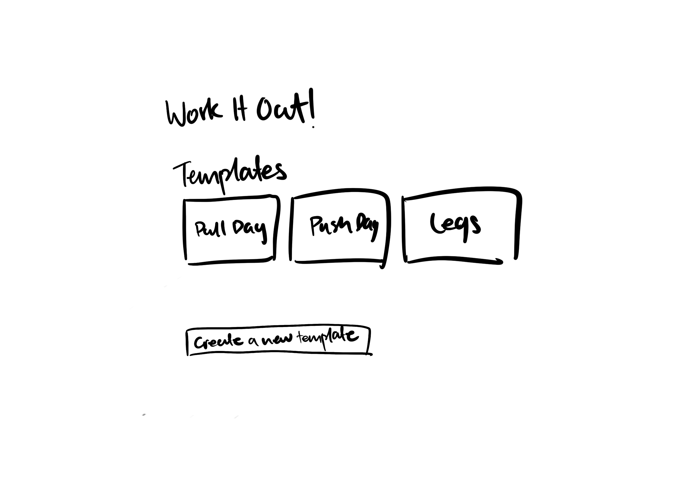
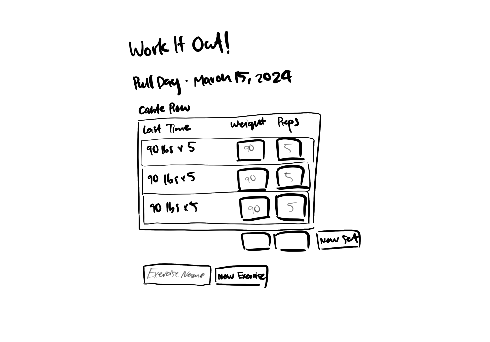

# Work it Out! 

## Overview

Work it Out is a web app that allows users to record their workout data! Users can add exercises they are planning to do, and record the number of reps they perform, and the weight with which they perform it.

Once they've started a workout, they can input the number of reps/weight they perform for a specific exercise, while on the side, their reps/weight performed in their most recent attempt at that specific exercise in a previous workout is displayed. The user can also click into a specific exercise and it will expand into a window showing their all-time history with that exercise. This is inspired by an existing workout tracker app named Strong!


## Data Model

The application will store Exercises and Atempts

* a user can have multiple exercises (via references)
* an exercises can have multiple attempts (via references)

My original plan was to implement Users and Workouts as well but I chose to limit the scope a bit.


An Example Workout: (NOT IMPLEMENTED)

```javascript
{
  user: // a reference to a User object
  name: "Pull Day",
  date: // date
  exercises: // an array of references to Exercise documents
}
```

An Example Exercise:

```javascript
{
  _id: new ObjectId('662c91504d256189a42e65b9'),
  exerciseName: 'Hammer Curls',
  lastAttempt: new ObjectId('662c9eb113cdc41a48a04d1a'),
  attempts: [
    {
      _id: new ObjectId('662c9eb113cdc41a48a04d1a'),
      lastDone: 2024-04-27T06:44:01.538Z,
      sets: [Array],
      __v: 0
    },
    {
      _id: new ObjectId('662c9a04c0513e7db981019c'),
      lastDone: 2024-04-27T06:24:04.400Z,
      sets: [],
      __v: 0
    }
}
```


## [Link to Commented First Draft Schema](db.mjs) 


## Wireframes

/home - landing page with start workout button



/home/create - page showing started workout, can add new exercises, record new weight/reps, and see attempt history for added exercises




## Site map

<!-- (__TODO__: draw out a site map that shows how pages are related to each other)

Here's a [complex example from wikipedia](https://upload.wikimedia.org/wikipedia/commons/2/20/Sitemap_google.jpg), but you can create one without the screenshots, drop shadows, etc. ... just names of pages and where they flow to. -->

## User Stories or Use Cases)

1. as a user, I can start a new workout
2. as a user, I can search for and add exercises to a current workout; if it is an exercise you have not done before, I can save it in the database
3. as a user, I can view a specific exercise's history and see a list of my previous sets from old workouts in a list, with an associated date
4. as a user, I can finish a workout and save all of my current reps/weights into their respective exercises


## Research Topics


* IMPLEMENTED! (2 points) Use a CSS framework or UI toolkit, use a reasonable of customization of the framework (don't just use stock Bootstrap - minimally configure a theme): tailwind.css
* (EDIT: did not end up implementing) (5 points) Integrate user authentication
* (EDIT: did not end up implementing) (4 points) Perform client side form validation using a JavaScript library 


2 points total out of 10 required points


## [Link to Initial Main Project File](app.mjs) 


## Annotations / References Used

1. [tailwind css documentation](https://tailwindcss.com/docs/installation) - (add link to source code that was based on this)
2. [tailwind css documentation on buttons](https://v1.tailwindcss.com/components/buttons) - 
3. [various notes from class slides on mongoDB](https://cs.nyu.edu/courses/spring24/CSCI-UA.0467-001/_site/)

